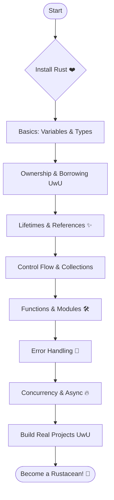

# 🌟 Learn **Rust** from Scratch with Fun & Practical Examples UwU


Welcome to the **ultimate repository to learn Rust**!
If you’ve ever wanted to write **safe, fast, and modern code**, Rust is your language.
Rust powers **blockchain**, **Web3**, **embedded systems**, **AI**, and much more.

This repo is here to make your journey **fun and clear** with:
✨ **Hands-on examples** explained step by step
✨ **Beginner-friendly concepts**
✨ **Cool projects** to apply what you learn
✨ **Crystal-clear docs** so you never feel lost

> Rust is love. Rust is life. Let’s make your code **safe and cute UwU**.

---

## ✅ Installing Rust

We use [rustup](https://rustup.rs/), the official installer.

### **Linux / macOS**

```bash
curl --proto '=https' --tlsv1.2 -sSf https://sh.rustup.rs | sh
```

Add Rust to PATH:

```bash
source $HOME/.cargo/env
```

Check version:

```bash
rustc --version
```

---

### **Windows (Normal Install)**

1. Download **Rustup** from [rust-lang.org](https://www.rust-lang.org/tools/install)
2. Run the installer and follow the steps
3. Check:

```powershell
rustc --version
```

---

### **Windows with WSL (Best Experience!)**

Why WSL?
✔ Linux power inside Windows
✔ Better compatibility for crates
✔ Smooth experience for real-world projects

Steps:

```bash
# Install WSL
wsl --install
# Update
sudo apt update && sudo apt upgrade -y
# Install Rust
curl --proto '=https' --tlsv1.2 -sSf https://sh.rustup.rs | sh
```

---

## 🎯 What Will You Learn Here?

1. **Rust Basics**

   * Why Rust? Memory safety, speed, and concurrency.

2. **Core Concepts**

   * Variables & Types
   * Ownership & Borrowing
   * Lifetimes explained in cute ways UwU

3. **Control Flow & Collections**

   * `match`, `if let`, iterators, vectors

4. **Functions & Modules**

   * Organize your code like a pro

5. **Error Handling**

   * `Result` & `Option` for safe coding

6. **Concurrency**

   * Threads & async/await for spicy speed

7. **Practical Projects**
   ✅ CLI To-Do App
   ✅ Mini REST API
   ✅ Password Generator
   ✅ Web3-Oriented Project (Hello Blockchain!)

---

## 🌈 UwU Roadmap to Rust Mastery



---

## 💖 Why Follow This Repo?

* 100% **practical content**, step by step
* **Cute documentation**, no boring walls of text
* **Fun challenges** to make you a pro
* Prepares you for **Web3, Cairo & High-performance systems**

---

### ✨ Useful Links

* [📖 The Rust Book](https://doc.rust-lang.org/book/)
* [🦀 Crates.io](https://crates.io)
* [✨ Rust Playground](https://play.rust-lang.org/)

---

💌 **Follow this repo, star it ⭐ and let’s learn Rust together UwU!**

