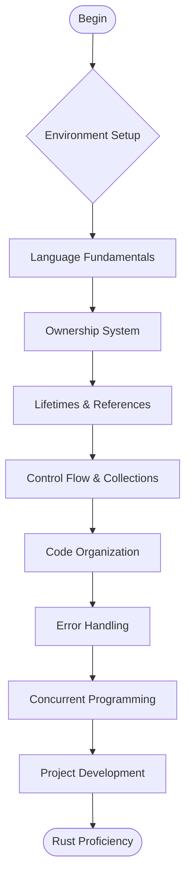

# 🦀 Learn Rust from Scratch: A Comprehensive Guide

Welcome to the **official Rust learning repository**! This resource is designed to help you master Rust programming through structured, practical examples and clear explanations. Rust is a systems programming language that empowers developers to build reliable and efficient software, with applications in blockchain, Web3, embedded systems, AI, and beyond.

## Repository Overview

This repository provides:
- **Structured learning path** from fundamentals to advanced topics
- **Hands-on code examples** with detailed explanations
- **Real-world projects** to reinforce learning
- **Comprehensive documentation** for reference

> Rust combines performance, reliability, and productivity. Let's build robust software together.

---

## 🛠 Installation Guide

### **Linux / macOS**

Install using the official rustup installer:

```bash
curl --proto '=https' --tlsv1.2 -sSf https://sh.rustup.rs | sh
```

Add to your PATH:
```bash
source $HOME/.cargo/env
```

Verify installation:
```bash
rustc --version
```

### **Windows**

**Option 1: Native Installation**
1. Download Rustup from [rust-lang.org](https://www.rust-lang.org/tools/install)
2. Run the installer and follow the prompts
3. Verify:
```powershell
rustc --version
```

**Option 2: WSL Installation (Recommended)**
```bash
# Install WSL if not present
wsl --install
# Update package manager
sudo apt update && sudo apt upgrade -y
# Install Rust
curl --proto '=https' --tlsv1.2 -sSf https://sh.rustup.rs | sh
```

---

## 📚 Curriculum Overview

### 1. **Rust Fundamentals**
- Memory safety principles
- Zero-cost abstractions
- Concurrency model

### 2. **Core Language Concepts**
- Variables and data types
- Ownership system
- Borrowing and lifetimes
- Structs and enums

### 3. **Control Structures & Collections**
- Pattern matching with `match`
- Control flow operators
- Vectors, strings, and hash maps
- Iterator patterns

### 4. **Code Organization**
- Functions and methods
- Module system
- Package management with Cargo

### 5. **Error Handling**
- `Result` and `Option` types
- Propagating errors
- Panic handling

### 6. **Advanced Topics**
- Concurrent programming
- Async/await patterns
- Smart pointers
- Unsafe Rust

### 7. **Practical Applications**
- Command-line interface applications
- REST API development
- System utilities
- Blockchain-oriented projects

---

## 🗺 Learning Path



---

## 🎯 Key Benefits

- **Industry-relevant skills** for high-performance computing
- **Memory safety** without garbage collection
- **Modern toolchain** with excellent package management
- **Cross-platform compatibility**
- **Growing ecosystem** in blockchain and systems programming

---

## 🔗 Additional Resources

- [**The Rust Programming Language Book**](https://doc.rust-lang.org/book/) - Official documentation
- [**Rust Standard Library Documentation**](https://doc.rust-lang.org/std/) - API references
- [**Crates.io**](https://crates.io) - Package registry
- [**Rust Playground**](https://play.rust-lang.org/) - Online code editor

---

## 📖 Repository Structure

```
learn-rust/
├── basics/           # Fundamental concepts
├── ownership/        # Ownership and borrowing
├── collections/      # Data structures
├── error_handling/   # Result and Option
├── concurrency/      # Parallel programming
├── projects/         # Practical applications
└── exercises/        # Practice problems
```

Each directory contains:
- Detailed explanations in README.md
- Code examples with comments
- Exercises with solutions
- Best practices and common patterns

---

## 🚀 Getting Started

Begin with the basics directory and progress sequentially through each topic. Each section builds upon previous concepts, ensuring a solid foundation before advancing to more complex topics.

Complete the exercises in each section to reinforce your understanding and apply concepts in practical scenarios.

---

## 🤝 Contribution

This repository welcomes contributions! Please see our contribution guidelines for:
- Reporting issues
- Suggesting improvements
- Submitting pull requests
- Adding new examples or exercises

---

*Star this repository to track your progress and reference materials as you learn.*
